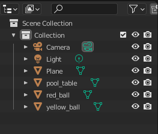
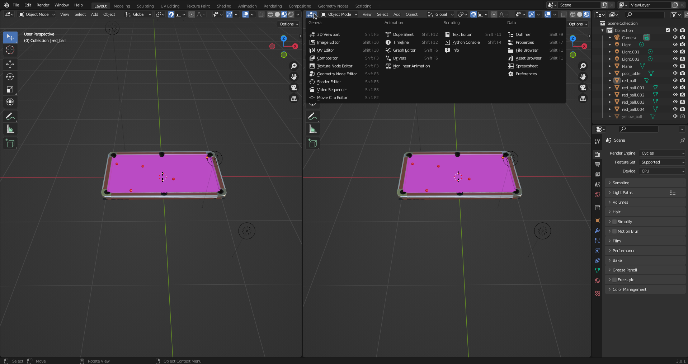
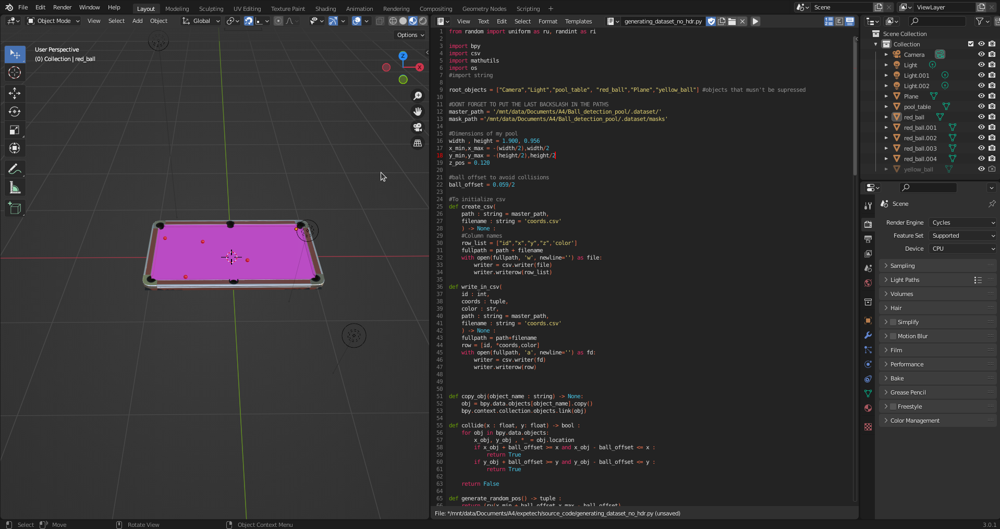

# State of the Art

Blender software is used to generate dataset for data segmentation
models. This software already has been employed to create food data to train segmentation model. The shape, volume, texture, color, and
composition of food vary. Blender allows to generate a huge amount of
data with variations (on food, lights and camera). In this case, the dataset trains a Mask R-CNN for instance segmentation.

# Tutorial

The objective of this tutorial is to show how to generate a dataset for a segmentation model. The dataset is generated using Blender software. The dataset is used to train a U-Net model for instance segmentation.

The dataset is composed of 2 parts :
    
- Images : the images are generated using Blender software. The images are saved in a folder. Those images are images of a pool table with different ball positions and light orientation.
- A file (.csv) : the file contains the position of the balls in the images and the color.

## Blender

Blender is a free and open-source 3D computer graphics software toolset used for creating animated films, visual effects, art and for many other application.

The use of Blender is pushed by the fact that the software can render images using ray tracing. Ray tracing is a rendering technique that simulates the physical behavior of light to render an image. It is a technique that can be used to create photorealistic images. The shadows are close to the reality and the reflections are also very realistic. The use of ray tracing is a good way to create a dataset for a segmentation model.

### Model

For the model, either you can create it or find model on the internet. In this tutorial, we will use a model of a pool table. The model is available on github[¹]. For the balls, we will use a simple sphere colored (yellow or red) with a glossy render close to real.

On Blender, you can see the objects that exist in your blender project in the `collection` section.

Example of collection section on the project :



The `"pool_table"`, `"red_ball"` and `"yellow_ball"` are the original model of the element. Only one instance of the each object is required to go further. 

### Layout

In Blender, the layout is essential. In order to use the python library of Blender (bpy), the easiest way is to code directly in the IDE (integrated development environment) provided by Blender.

Let's split the display. Get a corner of the model window and drag it.


Then click on the `editor type` button and choose `text editor`.



The text editor is now available. You can write your code in this editor and run it in the python console. But first, you need to create a new file. Click on the `new` button.
A new file is created. You can name it as you want.

Here is the layout that I use :



## Python

First of all, I higly recommend to read the documentation of Blender. You can find it [here](https://docs.blender.org/api/current/). 

Also you need to know the basics of python. You can find the documentation [here](https://docs.python.org/3/).


Then if you are running on a linux distribution, you should run Blender using the terminal. It will allow you to see the errors that you will have.

```python
blender <name-of-your-file>.blend
```

### Imports

The first step is to import the python library of Blender. The library is called `bpy`. You can import it with the following code :

```python
import bpy
```

We also imported the `os` library to save the output.

```python
import os
```

And some other import that are necessary for the code.

```python
from random import uniform as ru, randint as ri # random uniform and random integer
import mathutils
import csv # to save the csv file
```
 


### Variables

The first step is to define the variables. The variables are the parameters of the dataset. The variables are the following :

- `n_images` : the number of images that you want to generate


# References

[1] : Github repository [@yliess86/Snook](https://github.com/yliess86/Snook)